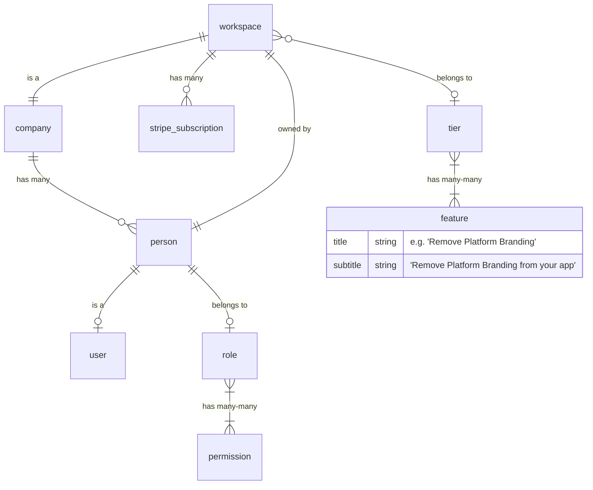

# @gravis-os/saas

```mermaid
erDiagram
	person ||--o| user : "is a"
	company ||--o{ person : "has many"
	workspace ||--|| company : "is a"
	workspace ||--o{ stripe_subscription : "has many"
	workspace ||--|| person : "owned by"
	person ||--o| role : "belongs to"
	role }|--|{ permission : "has many-many"
	workspace }o--o| tier : "belongs to"
	tier }|--|{ feature : "has many-many"
	feature {
		title string "e.g. 'Remove Platform Branding'"
		subtitle string "'Remove Platform Branding from your app'"
	}
```
